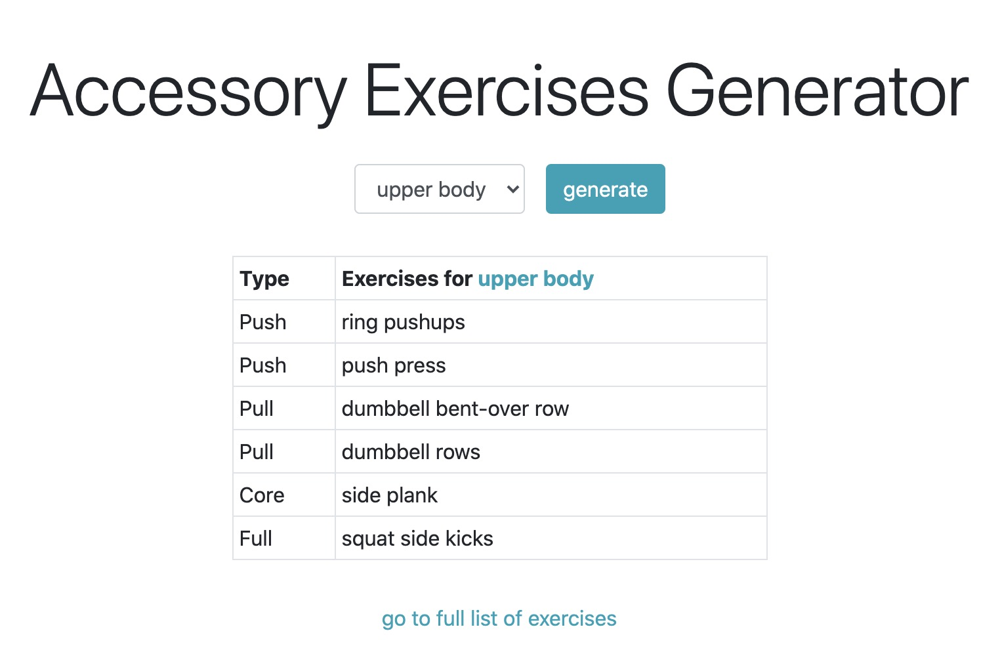
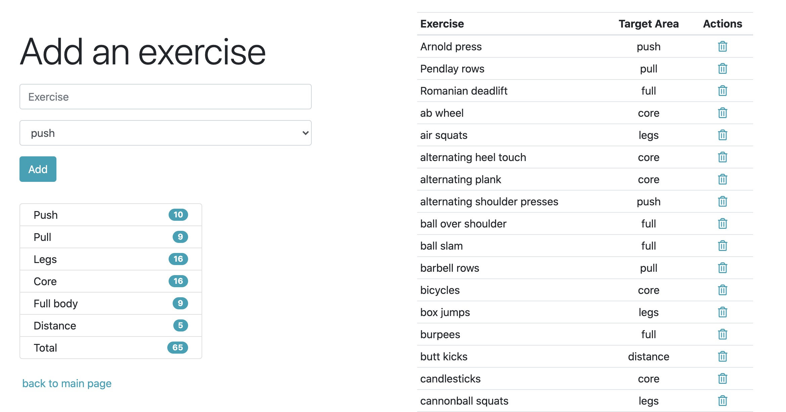

# Accessory Workout Generator

This app will generate six accessory exercises to complement a powerlifting workout. Alternatively, you may also perform these exercises on their own.

For an upper body day (bench press, overhead press), the generator will define the following:
<ul>
  <li>2 push exercises</li>
  <li>2 pull exercises</li>
  <li>1 core exercise</li>
  <li>1 full body exercise</li>
</ul>

For a lower body day (deadlift, squat), the generator will define the following:
<ul>
  <li>1 leg exercise</li>
  <li>2 pull exercises</li>
  <li>1 core exercise</li>
  <li>2 full body exercises</li>
</ul>

You may also add or delete exercises from the full list.

## Technologies

This is a fullstack app built with Flask, SQLite, and Bootstrap.

## Visuals

   
   

## Demo

Hosted on Heroku.

https://polar-mountain-37048.herokuapp.com/